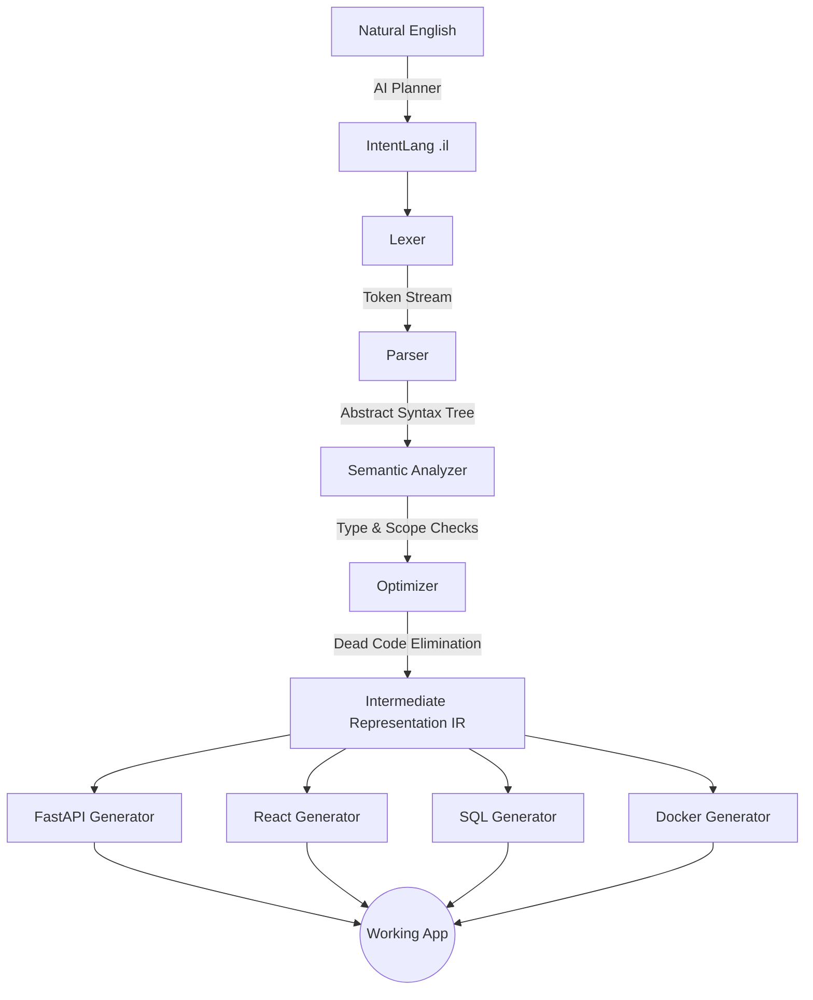

# IntentOS Hackathon Pitch

## 3-Minute Pitch Script

**[0:00 - The Hook]**
"Imagine you had a brilliant idea for a startup—a Library Management System. Normally, you'd spend weeks writing user stories, days setting up the backend, and months fighting React components and databases. But what if you could just *describe* what you want and have a fully deterministic compiler generate production-ready code in 50 milliseconds? Enter IntentOS: The AI Development Operating System."

**[1:00 - The Demo]**
"Instead of relying on LLMs to hallucinate boilerplate code, IntentOS uses AI strictly to map your natural English intent into a deterministic Intermediate Representation called IntentLang. Let me show you. (Show IDE). Here is our Library System intent. (Hit compile). In less than 1.5 seconds, IntentOS parses this into an AST, runs semantic analysis to verify references—catching errors if we forgot a page—optimizes the graph, and generates 45 files across a FastAPI backend, a React frontend, SQLite schemas, and Docker configs."

**[2:00 - The Architecture & Vision]**
"Because the compilation pipeline is zero-dependency and entirely deterministic, there is no hallucinated code, no token limits, and no security vulnerabilities injected by an LLM. It guarantees a flawless build every time. Look at this visualizer—(Show AST/IR Pipeline Tab). You see every Lexer token, every AST node. IntentOS bridges the gap between the chaotic creativity of AI and the rigid reliability of classical compilers. Thank you."

---

## 10-Minute Presentation Outline

1. **Introduction & The Problem (2 mins)**
   - AI code generators (Copilot, Devin) hallucinate and fail at complex architectures.
   - The lack of deterministic guarantees makes AI apps unmaintainable.

2. **The IntentOS Solution (2 mins)**
   - We separated the "Intent" from the "Implementation".
   - AI translates English to IntentLang. The classical Compiler translates IntentLang to working full-stack apps.

3. **Live Demo: The Compiler Pipeline (3 mins)**
   - Type english prompt.
   - Show the generated `library-management.il`.
   - Show the IDE Visualizer Panel (Tokens -> AST -> IR -> Code).
   - Demonstrate semantic error catching (e.g. referencing a non-existent page).

4. **Technical Highlights (2 mins)**
   - Pure Python zero-dependency compiler (Lexer, Parser, Semantic Analyzer, Optimizer).
   - Generates React (Frontend), FastAPI/Express (Backend), SQL, and Docker.
   - Built-in incremental compilation and AST fingerprinting for sub-millisecond rebuilds.

5. **Future Roadmap & Business Model (1 min)**
   - Monetize via enterprise compiler extensions and cloud hosting of compiled intents.
   - Add native mobile targets (Flutter, Swift) via new compiler backend generators.

---

## Architecture Diagram (Mermaid)

## Innovation Highlights
- **Deterministic AI Generation**: LLMs never touch source code. They only write IntentLang.
- **Micro-Compiler**: A complete, rigorous programming language compiler written from scratch without parser-generators.
- **Pipeline Visualizer**: Transparent, glassmorphism UI that visualizes the AST and compilation memory in real-time.
